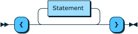
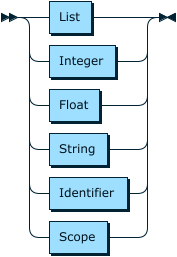
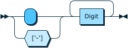
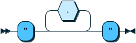

**Program:**


```
Program  ::= Start Scope End
```

**Scope:**



```
Scope    ::= '{' Statement* '}'
```

referenced by:

* Atom
* Program

**Statement:**


```
Statement
         ::= '(' Identifier Atom ')'
```

referenced by:

* Scope

**Atom:**



```
Atom     ::= List
           | Integer
           | Float
           | String
           | Identifier
           | Scope
```

referenced by:

* List
* Statement

**List:**


```
List     ::= '(' Atom* ')'
```

referenced by:

* Atom

**Integer:**



```
Integer  ::= [ '-'] Digit+
```

referenced by:

* Atom

**Float:**


```
Float    ::= [ '-'] Digit+ '.' Digit+
```

referenced by:

* Atom

**String:**



```
String   ::= '"' .* '"'
```

NOTE: `.` matches anything but `"`

referenced by:

* Atom

**Identifier:**


```
Identifier
         ::= .*
```

referenced by:

* Atom
* Statement

**Digit:**


```
Digit    ::= '0-9'+
```

referenced by:

* Float
* Integer

## 
 <sup>generated by [RR - Railroad Diagram Generator][RR]</sup>

[RR]: http://bottlecaps.de/rr/ui